# Git&黑马就业数据平台-day02


## JWT介绍

> JSON Web Token是目前最为流行的跨域认证解决方案

[如何获取:](https://jwt.io/introduction)在使用 JWT 身份验证中，当用户使用其凭据成功登录时，将返回 JSON Web Token（令牌）

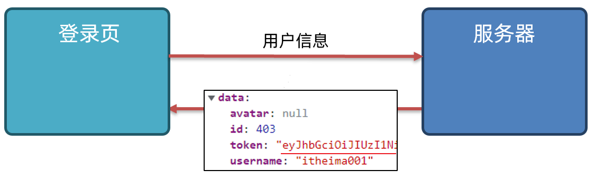

登录成功之后，服务器会返回 **token**

**作用:** 允许用户访问使用该令牌（token）允许的路由、服务和资源

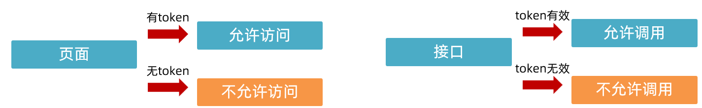


## 首页-页面访问控制

> 在访问特定页面的时候，根据是否登录来决定是否允许访问

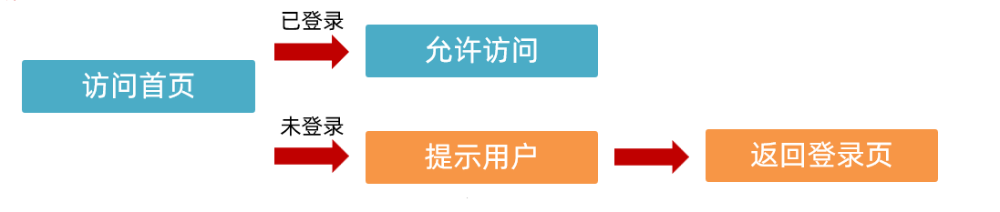


**核心步骤:**

1. 抽取校验函数（多个页面需要使用）
2. 判断token（缓存中的token）
3. 提示用户并跳转登录页
4. 页面调用（目前考虑首页即可）


**关键代码:**

1. `common.js`

```javascript
// 抽取校验函数（判断是否登录）
function checkLogin() {
  // 判断token
  const token = localStorage.getItem('token')
  // console.log(token)
  // token为null说明没有缓存
  if (token === null) {
    showToast('请先登录')
    setTimeout(() => {
      location.href = 'login.html'
    }, 1500)
  }
}
```

2. `index.js`

```javascript
// 调用判断是否登录的函数
checkLogin()
```


**git记录:**

```bash
git add .
git commit -m"首页-页面访问控制"
```


## 首页-用户名渲染

> 渲染缓存中的用户名

**需求:**

* 将登录成功之后缓存的用户名，渲染到页面的右上角

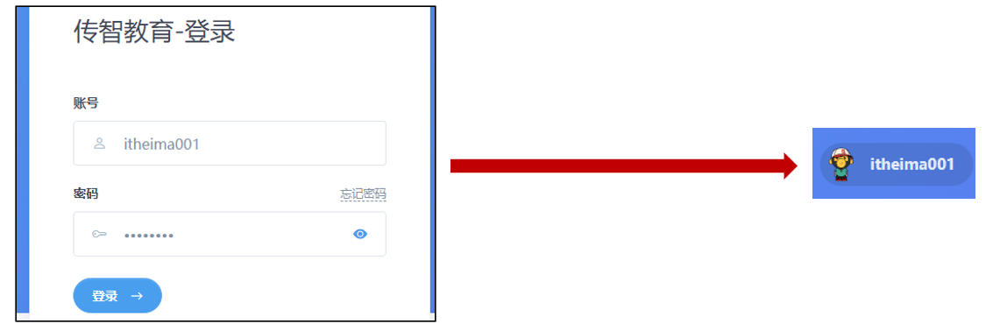


**核心步骤:**

1. 抽取渲染函数（多页面使用）
2. 读取并渲染用户名（缓存中）
3. 页面调用函数（目前考虑首页）


**关键代码:**

1. `common.js`

```javascript
// 抽取渲染函数（渲染缓存中的用户名）
function renderUsername() {
  // 读取并渲染用户名
  const username = localStorage.getItem('username')
  // console.log(username)
  document.querySelector('.username').innerText = username
}
```

2. `index.js`

```javascript
// 调用渲染用户名的函数
renderUsername()
```

**git记录:**

```bash
git add .
git commit -m"首页-用户名渲染"
```


## 首页-退出登录

> 完成首页退出登录操作

**需求:**

1. 点击退出按钮，删除缓存数据（token，用户名）
2. 返回登录页

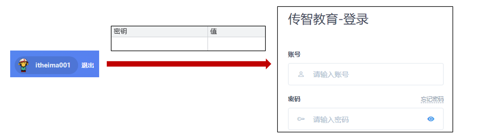


**核心步骤:**

1. 抽取退出登录函数（复用）
2. 绑定点击事件
3. 删除缓存并跳转登录页（token，用户名）
4. 页面调用（目前考虑首页）


**关键代码:**

1. `common.js`

```javascript
// 抽取退出登录函数
function registerLogout() {
  // 绑定点击事件
  document.querySelector('#logout').addEventListener('click', () => {
    // console.log('点了退出')
    // 删除缓存并跳转登录页
    localStorage.removeItem('username')
    localStorage.removeItem('token')
    location.href = 'login.html'
  })
}
```

2. `index.js`

```javascript
// 调用退出登录函数 给退出按钮注册点击事件
registerLogout()
```


**git记录:**

```bash
git add .
git commit -m"首页-退出登录"
```


## 首页-统计数据

> 获取首页统计数据并渲染

**需求:**

1. 调用接口获取数据并渲染

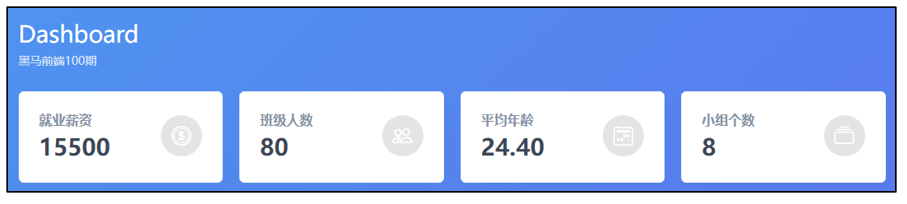


**数据接口:**

1. 统计数据接口需要**登录**才可以调用
2. 调用时需要在请求头中携带token

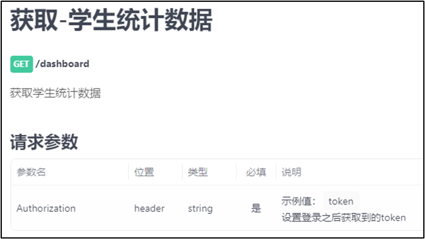


**axios设置请求头:**

1. headers属性设置对象
2. key:根据文档设置，比如`Authorization`
3. value:携带到服务器的值

```javascript
axios({
  url: '/dashboard',
  headers: {
    Authorization: 'token'
  }
})
```

**核心步骤:**

1. 根据文档调用接口
2. 渲染数据


**关键代码:**

1. `index.js`

```javascript
// 首页-统计数据
async function getData() {
  const token = localStorage.getItem('token')
    // 调用接口(登录成功之后才可以调用)
    const res = await axios({
      url: '/dashboard',
      // 请求头中携带token
      // 不携带token，直接报错
      headers: {
        Authorization: token
      }
    })
    const overview = res.data.data.overview

    // 渲染数据
    Object.keys(overview).forEach(key => {
      document.querySelector(`.${key}`).innerText = overview[key]
    })
}

getData()
```


**git记录:**

```bash
git add .
git commit -m"首页-统计数据"
```


## 首页-登录状态失效

> 首页-登录状态失效

**需求:**

1. 调用接口时，token
   1. 有效:正常调用
   2. 无效: 提示用户，清除缓存，返回登录页

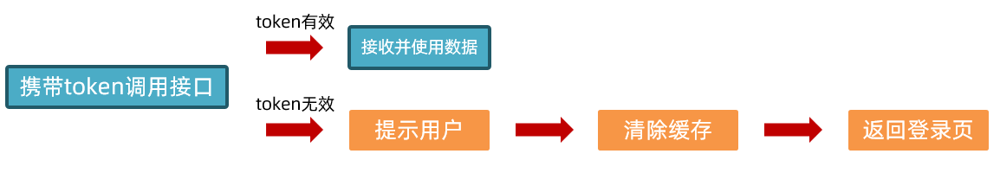

**核心步骤:**

1. 判断token失效（401状态码）
2. 删除缓存并提示用户
3. 返回登录页
4. **注意:**可以通过修改缓存中的token模拟失效，默认失效时间（2个小时）


**关键代码:**

1. `index.js`

```javascript
// 首页-统计数据
async function getData() {
  const token = localStorage.getItem('token')
  try {
    // 调用接口(登录成功之后才可以调用)
    const res = await axios({
      url: '/dashboard',
      // 请求头中携带token
      // 不携带token，直接报错
      headers: {
        Authorization: token
      }
    })
    const overview = res.data.data.overview

    // 渲染数据
    Object.keys(overview).forEach(key => {
      document.querySelector(`.${key}`).innerText = overview[key]
    })
  } catch (error) {
    // 首页-登录状态过期
    // 判断token失效（状态码401）:token过期，token被篡改
    if (error.response.status === 401) {
      // 删除缓存并提示用户
      localStorage.removeItem('username')
      localStorage.removeItem('token')
      // 使用普通用户可以理解的方式提示他们
      showToast('请重新登录')

      // 返回登录页
      setTimeout(() => {
        location.href = 'login.html'
      }, 1500)
    }
  }

}

getData()
```


**git记录:**

```bash
git add .
git commit -m"首页-登录状态失效"
```


## axios-拦截器

> [作用](https://www.axios-http.cn/docs/interceptors): 请求发送之前，响应回来之后执行一些 公共 的逻辑

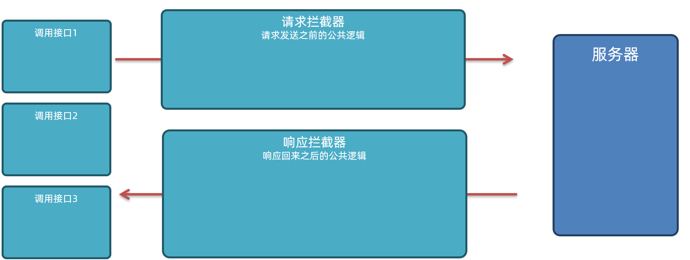

1. 注册之后，调用接口
2. 请求发送时--》执行请求拦截器--》服务器
3. 服务器响应内容--》执行响应拦截器--》接收数据


## axios请求拦截器-统一设置token

> 通过请求拦截器统一设置token

**需求:**

1. 通过请求拦截器统一设置token
2. 设置一次之后后续调用接口不用单独设置


**请求拦截器-基本写法:**

```javascript
// 添加请求拦截器
axios.interceptors.request.use(function (config) {
  // 在发送请求之前做些什么,比如: 统一设置token
  // 通过config可以获取请求的设置，比如headers可以获取（修改）请求头
  return config;
}, function (error) {
  // 对请求错误做些什么
  return Promise.reject(error);
});

```

**核心步骤:**

1. 添加请求拦截器
2. 统一设置token
3. 移除首页对应逻辑


**关键代码:**

1. `commons.js`

```javascript
// 添加请求拦截器
// 统一携带token
axios.interceptors.request.use(function (config) {
  // 可以通过headers，查看+设置请求头
  // config.headers['info'] = 'itheima666'
  // 每次发送请求，都会执行这个回调函数
  // console.log(config)
  // 在发送请求之前做些什么,比如: 统一设置token
  const token = localStorage.getItem('token')
  // token存在，才携带
  if (token) {
    config.headers['Authorization'] = token
  }
  return config;
}, function (error) {
  // 对请求错误做些什么
  return Promise.reject(error);
});

```

2. `index.js`

```javascript
// 首页-统计数据
async function getData() {
  try {
    // 调用接口(登录成功之后才可以调用)
    const res = await axios({
      url: '/dashboard',
      // 通过axios请求拦截器统一携带
    })
    const overview = res.data.data.overview

    // 渲染数据
    Object.keys(overview).forEach(key => {
      document.querySelector(`.${key}`).innerText = overview[key]
    })
  } catch (error) {
    // 首页-登录状态过期
    // 判断token失效（状态码401）:token过期，token被篡改
    // console.dir(error)
    if (error.response.status === 401) {
      // 删除缓存并提示用户
      localStorage.removeItem('username')
      localStorage.removeItem('token')
      // 使用普通用户可以理解的方式提示他们
      showToast('请重新登录')

      // 返回登录页
      setTimeout(() => {
        location.href = 'login.html'
      }, 1500)
    }
  }
}
```


**git记录:**

```bash
git add .
git commit -m"axios请求拦截器-统一设置token"
```


## axios响应拦截器-统一处理token失效

> axios响应拦截器-统一处理token失效

**需求:**

1. 通过 axios响应拦截器-统一处理token失效

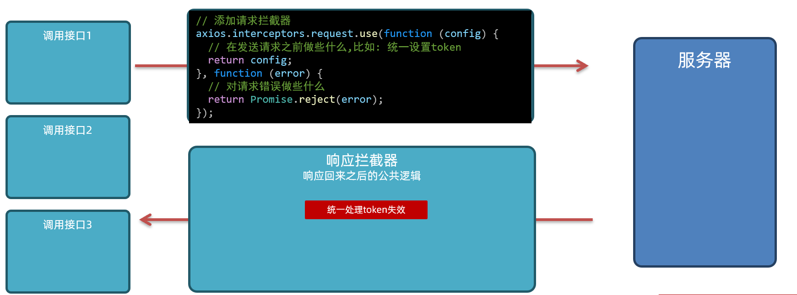

**响应拦截器-基本写法:**

```javascript
// 添加响应拦截器
axios.interceptors.response.use(function (response) {
  // 2xx 范围内的状态码都会触发该函数。
  // 对响应数据做点什么，比如: 数据剥离
  return response;
}, function (error) {
  // 超出 2xx 范围的状态码都会触发该函数。
  // 对响应错误做点什么: 比如统一处理token失效
  return Promise.reject(error);
});

```

**核心步骤:**

1. 添加响应拦截器
2. 统一处理token失效
3. 移除首页对应逻辑


**关键代码:**

1. `common.js`

```javascript
// 添加响应拦截器
// 统一处理token过期
axios.interceptors.response.use(function (response) {
  // 2xx 范围内的状态码都会触发该函数。
  return response;
}, function (error) {
  // console.dir(error)
  // 超出 2xx 范围的状态码都会触发该函数。
  // 对响应错误做点什么: 比如统一处理token失效
  // 统一处理token失效
  if (error.response.status === 401) {
    // 弹框提示用户
    showToast('请重新登录')
    // 删除缓存
    localStorage.removeItem('token')
    localStorage.removeItem('username')
    // 返回登录页
    setTimeout(() => {
      location.href = 'login.html'
    }, 1500)
  }
  return Promise.reject(error);
});
```

2. `index.js`

```javascript
// 首页-统计数据
async function getData() {
  // 调用接口(登录成功之后才可以调用)
  const res = await axios({
    url: '/dashboard',
    // 通过axios请求拦截器统一携带
  })
  const overview = res.data.data.overview

  // 渲染数据
  Object.keys(overview).forEach(key => {
    document.querySelector(`.${key}`).innerText = overview[key]
  }) 
}
```

**git记录:**

```bash
git add .
git commit -m"axios响应拦截器-统一处理token失效"
```


## axios响应拦截器-数据剥离

> axios响应拦截器-数据剥离

**需求:**

1. axios响应拦截器-数据剥离

2. 页面中使用数据时少写一个`data`

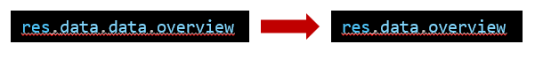


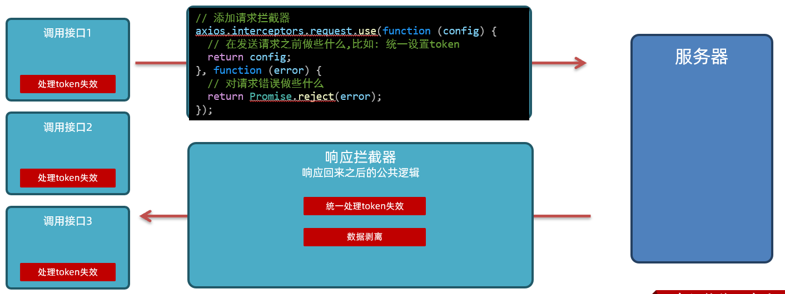

**核心步骤:**

1. 剥离data属性（响应拦截器）
2. 调整数据使用逻辑（登录，注册，首页）


**关键代码:**

1. `commons.js`

```javascript
// 添加响应拦截器
// 统一处理token过期
// 数据剥离
axios.interceptors.response.use(function (response) {
  // 2xx 范围内的状态码都会触发该函数。
  // 对响应数据做点什么，比如: 数据剥离
  // 剥离data属性，页面中少写.data属性，直接可以获取到数据
  return response.data;
}, function (error) {
  // console.dir(error)
  // 超出 2xx 范围的状态码都会触发该函数。
  // 对响应错误做点什么: 比如统一处理token失效
  // 统一处理token失效
  if (error.response.status === 401) {
    // 弹框提示用户
    showToast('请重新登录')
    // 删除缓存
    localStorage.removeItem('token')
    localStorage.removeItem('username')
    // 返回登录页
    setTimeout(() => {
      location.href = 'login.html'
    }, 1500)
  }
  return Promise.reject(error);
});
```


2. `index.js`:移除多余的`.data`

```javascript
// 首页-统计数据
async function getData() {
  // 调用接口(登录成功之后才可以调用)
  const res = await axios({
    url: '/dashboard',
    // 通过axios请求拦截器统一携带
  })
  const overview = res.data.overview

  // 渲染数据
  Object.keys(overview).forEach(key => {
    document.querySelector(`.${key}`).innerText = overview[key]
  }) 
}
```

3. `register.js`:移除多余的`.data`,`try`中

```javascript
document.querySelector('#btn-register').addEventListener('click', async () => {
  // 1. 收集并校验数据
  const form = document.querySelector('.register-form')
  const data = serialize(form, { empty: true, hash: true })
  // console.log(data)
  const { username, password } = data
  console.log(username, password)
  // 非空校验
  if (username === '' || password === '') {
    showToast('用户名和密码不能为空')
    return
  }

  // 长度校验
  if (username.length < 8 || username.length > 30 || password.length < 6 || password.length > 30) {
    showToast('用户名的长度为8-30,密码的长度为6-30')
    return
  }

  // 2. 数据提交
  try {
    // .post 请求方法 post，参数1:请求URL，参数2:提交的数据
    const res = await axios.post('/register', { username, password })
    // console.log(res)
    showToast(res.message)
  } catch (error) {
    // console.dir(error)
    showToast(error.response.data.message)
  }
})
```


4. `login.js`:移除多余的`.data`,`try`中

```javascript
document.querySelector('#btn-login').addEventListener('click', async () => {
  // 1. 收集并校验数据
  const form = document.querySelector('.login-form')
  const data = serialize(form, { empty: true, hash: true })
  console.log(data)
  const { username, password } = data
  // 非空判断
  if (username === '' || password === '') {
    showToast('用户名和密码不能为空')
    return
  }

  // 格式判断
  if (username.length < 8 || username.length > 30 || password.length < 6 || password.length > 30) {
    showToast('用户名长度8-30，密码长度6-30')
    return
  }

  // 2. 提交数据
  try {
    const res = await axios.post('/login', { username, password })
    // console.log(res)
    showToast(res.message)
    // 3. 缓存响应数据
    localStorage.setItem('token', res.data.token)
    localStorage.setItem('username', res.data.username)
    // 4. 跳转首页
    // 延迟一会在跳转，让提示框显示
    setTimeout(() => {
      // login.html和index.html的相对关系
      location.href = './index.html'
    }, 1500)

  } catch (error) {
    // console.dir(error)
    showToast(error.response.data.message)
  }

})
```

**git记录:**

```bash
git add .
git commit -m"axios响应拦截器-数据剥离"
```


## Git远程仓库

> [文档地址](https://git-scm.com/book/zh/v2/Git-基础-远程仓库的使用)[: ](https://git-scm.com/book/zh/v2/Git-基础-远程仓库的使用)远程仓库是指托管在因特网或其他网络中的你的项目的版本库。

**作用:**

1. 本地仓库备份
2. 多人写作

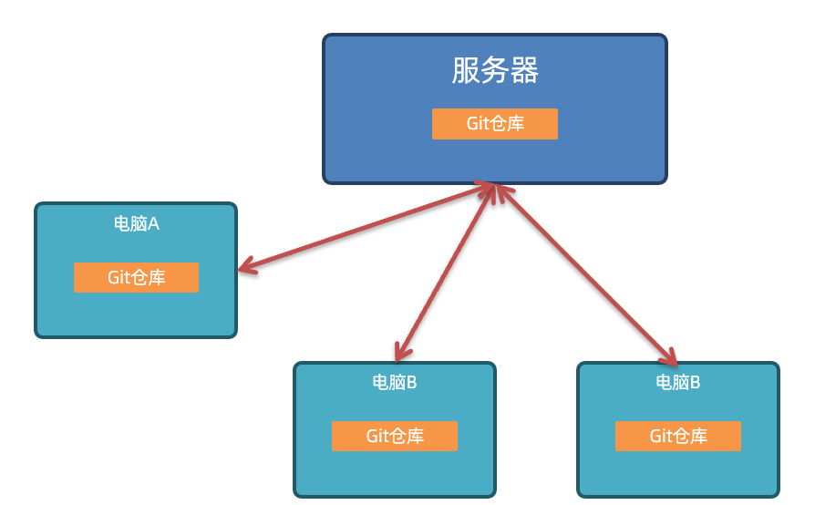


**常见Git远程仓库:**

1. [Github](https://github.com/):*GitHub*是一个面向开源及私有软件项目的托管平台，因为只支持Git作为唯一的版本库格式进行托管，故名*GitHub*。
   1. 国内访问较慢
2. [gitee](https://gitee.com/):*gitee*是开源中国（OSChina）推出的基于Git的代码托管服务。
   1. 服务器在国内，访问迅速
   2. 课程中主要用这个
3. [gitlab](https://www.gitlab.com/):*GitLab* 是一个用于仓库管理系统的开源项目，使用Git作为代码管理工具，并在此基础上搭建起来的Web服务。
   1. 一般是公司内部部署并使用
4. 注意:无论使用哪种，只要是基于Git的，用法大同小异


## gitee-使用准备

> 完成 gitee的使用准备工作

**关键步骤:**

1. 注册账号: 打开[gitee](https://gitee.com/)，右上角找到注册

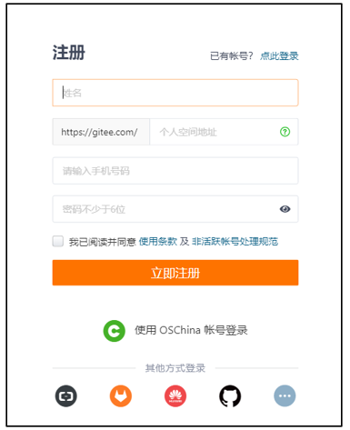

2. 绑定邮箱: 登录之后，右上角点击添加绑定，根据提示新增邮箱即可

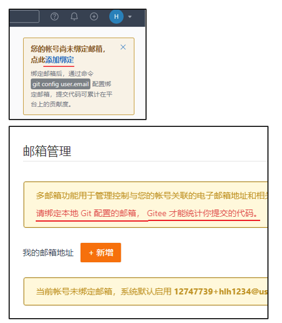

3. 修改默认分支: 找到个人设置，修改**仓库首选项**---默认分支名改为`main`

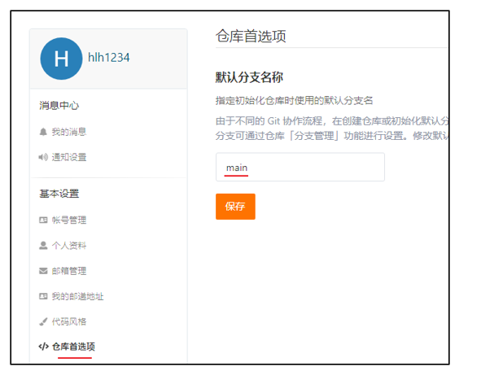


## Git远程仓库-新建仓库&推送

> 完成新建仓库&推送

**需求:**

1. 新建gitee远程仓库，并且把本地的代码推送到服务器上

**核心步骤:**

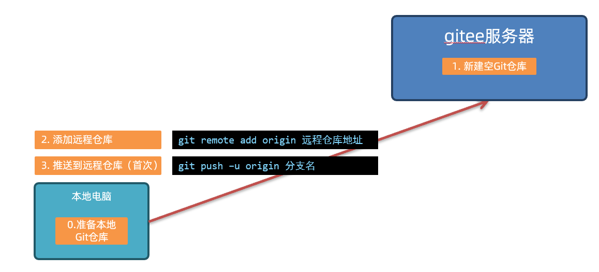


1. 点击右上角的**+**,选择新建仓库

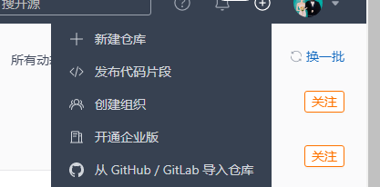

2. 设置必填项，完成新建

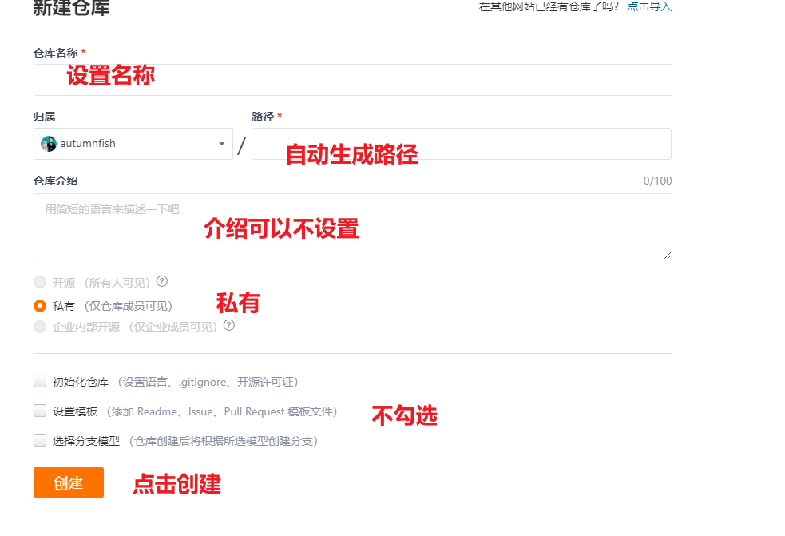

3. 在项目根目录打开`git bash`或`终端`，依次执行2-3行命令

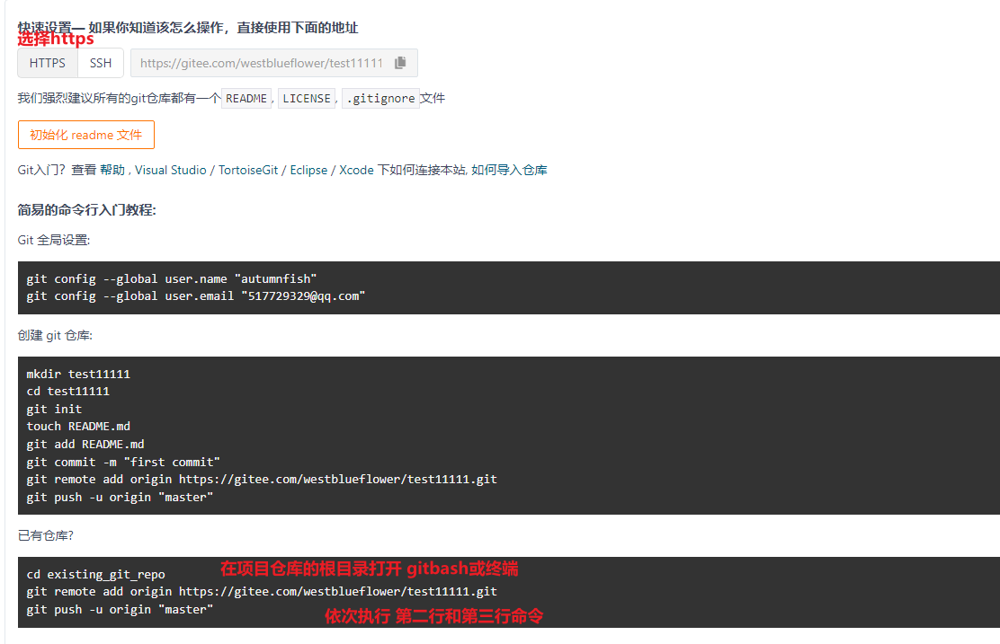


## Git远程仓库-克隆

> 远程仓库-克隆

**需求:**

1. 克隆（clone）: 获得一份已经存在了的 Git 仓库的拷贝


**核心步骤:**


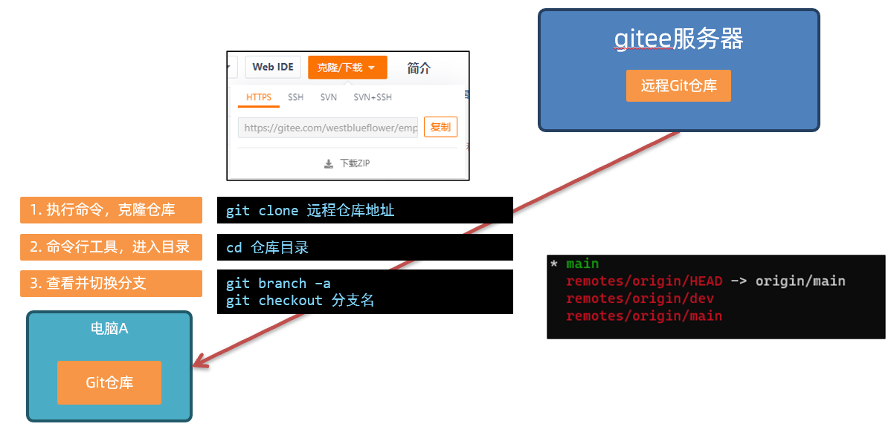

1. 执行命令，克隆仓库`git clone 远程仓库地址`（地址直接在仓库首页，进行拷贝）
   1. **注意:**不是URL地址，选择**克隆/下载**，找到**HTTPS**，点击**复制**
2. 拷贝之后，命令行工具通过`cd 仓库目录`进入项目
3. 可以查看并切换分支
   1. **注意:**`git branh -a`查看全部分支（本地+远程）
   2. 切换远程分支，只需要分支名即可，比如
      1. 显示的是`remotes/origin/dev`
      2. 切换命令`git checkout dev`即可


## Git远程仓库-拉取

> 远程仓库-拉取

**拉取（pull）作用:**

1. 从远程仓库拉取代码并合并到本地

2. **注意:** 如果要让其他人访问自己的仓库，需要设置为 开源

**关键步骤:**

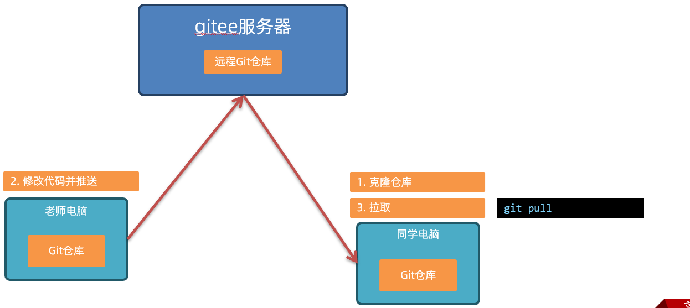


**设置开源:**

1. 仓库首页点击**管理**
2. 拉到底勾选对应的选项，然后保存即可
   1. **注意:**仓库需要有内容才可以设置开源
3. 接下来直接将**仓库的gitee的URL地址**给其他小伙伴即可

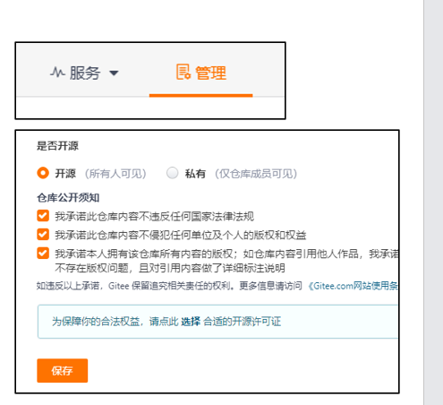


## Git远程仓库-配置SSH

> 远程仓库-配置SSH

SSH是一种网络协议，用于计算机之间的加密登录，配置完毕之后再对远程仓库进行操作不需要输入**用户名和密码**

[文档地址:](https://gitee.com/help/articles/4181)


**关键步骤:**（强烈建议参考官方文档或视频）

**注意:**以下命令执行的`git bash`或`终端`没有路径要求，在哪里打开的都行

1. 生成SSH公钥 

   ```bash
   ssh-keygen -t ed25519 -C "任意名字"
   ```

2. 查看及拷贝公钥

   ```bash
   cat ~/.ssh/id_ed25519.pub
   ```

3. 配置公钥到[gitee](https://gitee.com/profile/sshkeys)

4. 测试激活

   ```bash
   ssh -T git@gitee.com
   ```

   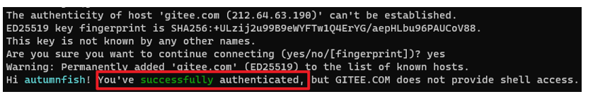


## Git远程仓库-重新上传

> 远程仓库-重新上传

**需求:**

1. 使用刚刚配置好的SSH，重新上传代码


**关键步骤:**

1. 新建远程仓库并设置开源（这步不是必须的）

2. 删除远程仓库地址: 

   ```bash
   # 删除之前记录的地址
   git remote remove origin
   ```

3. 添加远程仓库（这次是ssh地址）

   ```bash
   # 添加SSH地址
   git remote add origin 远程仓库SSH地址
   ```

4. 推送到远程仓库

   ```bash
   # 本地某分支推送到远程，并建立关联（第一次）
   git push -u origin 分支名
   # 后续直接推送即可
   git push
   ```

   


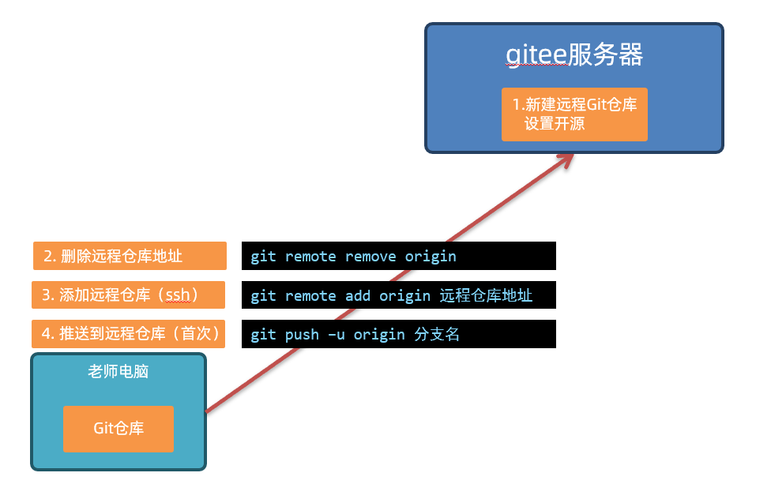